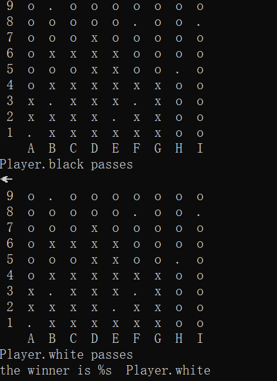
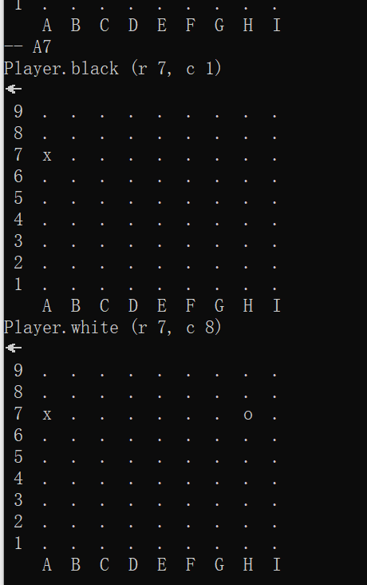

## 前言

于笔者而言，本次复现这个程序的动机全部来源于一次上网冲浪看见的


于是在开心地买了这本书并拜读后，便制作了此次的程序，本书使我收益匪浅，因为笔者并没有经过完整的python教学，python于我而言的确只是一个用于处理图片，文本表格，数据统计以及复现深度学习的工具，通过这本书，可以看见一个成熟的程序员利用python制作一个系统，包裹一个个包，极尽使用python各个特性，同时本书也并不失趣味性，理解围棋的规则并理解如何使用程序去表达也是一大看点，是我最近的极力推荐！

实现效果如图：当两方同时选择跳过本局终止并输出胜者，‘x’代表黑子,'o'代表白子，'.'代表没有落子



## 2.使用方法

一共制作了两个程序，一个是机器人与机器人互相对弈的程序，

```python
python bot_v_bot.py
#对于该程序笔者为调试方便将程序的睡眠时间给停止了，导致下棋的速度会非常快，读者可以将，该文件中
#time.sleep取消注释，或自由设置停止时间即可
```

另一个是人与机器人互相对弈的程序，实现效果如图：



即当我们想要下棋的时候，字母和数字组合标识唯一的落子点，如输入A7那么黑子落在A7，同时计算机对于我们下的这步给予回应

```python
python human_v_bot.py
```

## 结语

会持续更新关于这段程序的改进版本，但由于这段时间实在是太忙了。。。。。，又忙又懒所以就不写博客记录了，用个人的git记录算了。